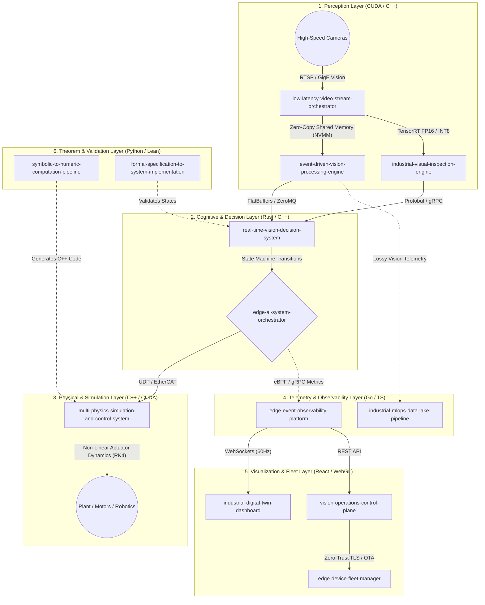

# Industrial Edge AI & Vision Ecosystem: Master Architecture

## 1. Mathematical and System-Theoretic Overview

The `Industrial-Edge-Labs` ecosystem operates on a fundamental principle of Information Theory and Non-Linear Control Systems: **Stochastic continuous environments must be deterministically quantized into bounded actionable states with minimal latency.**

This architecture is not merely a software stack, but a **high-frequency cyber-physical topology**. It translates raw analog/digital world states (video streams, uncalibrated sensor data) into mathematical invariants, decides upon them using formal logic, and feeds the output into either physical actuators (via PLCs) or non-linear multi-physics simulations (via RK4 integration strategies).

---

## 2. Core Operational Modules (Deep Dive)

### 2.1 The Perception and Intake Pipeline
- **`low-latency-video-stream-orchestrator`**: Ingests massive bandwidth matrices. Optimized with `epoll`, lock-free Queues, and hardware-accelerated video decoding (NVDEC). Ensures $O(1)$ routing complexity.
- **[`event-driven-vision-processing-engine`](https://github.com/Industrial-Edge-Labs/event-driven-vision-processing-engine)**: Drops redundant static frames. Computes temporal gradients ($dV/dt$) and generates spatial events ("Object $X$ breached Zone $Y$ at $t_n$"). Node-specific documentation: [event-driven-vision-processing-engine/architecture.md](./event-driven-vision-processing-engine/architecture.md).
- **`industrial-visual-inspection-engine`**: Deep anomaly detection utilizing Vision Transformers (ViT) or YOLO-style single-shot detectors compiled to TensorRT. Runs in parallel to the main sequence, producing confidence interval scores $C \in [0, 1]$.

### 2.2 The Deterministic Core
- **`real-time-vision-decision-system`**: Takes semantic output from the perception graphs and evaluates Hard-Real-Time (HRT) logic maps. It uses an internal finite state machine (FSM).
- **`edge-ai-system-orchestrator`**: The monolithic orchestrator. Implemented using CPU pinning, thread isolation, and bypasses kernel networking (via DPDK) where possible to maintain standard deviations of latency under $10\mu s$.

### 2.3 The Infrastructure, Feedback & WebGL Systems
- **`edge-event-observability-platform`**: Time-series database optimized for high-write-throughput (LSM trees). Captures everything from application-level events to PCIe bus latency spikes.
- **`industrial-digital-twin-dashboard`**: A React/Three.js Application that interpolates incoming 60Hz telemetry into a smooth 144Hz 3D environment, utilizing WebWorker pools to decouple network parsing from the rendering thread.
- **`industrial-mlops-data-lake-pipeline`**: Automatically ingests low-confidence frames ($C < 0.6$) and feeds them to cloud instances for Active Learning.
- **`edge-device-fleet-manager`**: Orchestrates container lifecycles via Kubernetes (K3s) or custom binaries across hundreds of NVIDIA Jetson / IPC edge nodes.

## 3. Deployment Constraints

To guarantee the required constraints ($<5ms$ end-to-end inference-to-actuation):
1. **Memory Allocations**: No dynamic heap allocations (`malloc`/`new`) in the critical hot-path. 
2. **Context Switches**: Minimized by utilizing lock-free SPSC (Single Producer Single Consumer) ring buffers.
3. **Data Localization**: Processes must align NUMA nodes to prevent cross-QPI memory fetching fetching latencies.
