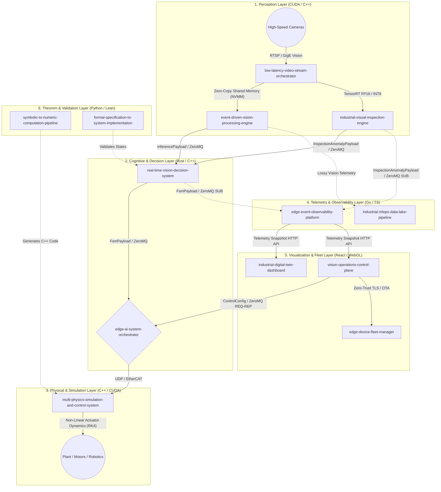

# Industrial Edge AI & Vision Ecosystem: Master Architecture

## 1. Mathematical and System-Theoretic Overview

The `Industrial-Edge-Labs` ecosystem operates on a fundamental principle of Information Theory and Non-Linear Control Systems: **Stochastic continuous environments must be deterministically quantized into bounded actionable states with minimal latency.**

This architecture is not merely a software stack, but a **high-frequency cyber-physical topology**. It translates raw analog/digital world states (video streams, uncalibrated sensor data) into mathematical invariants, decides upon them using formal logic, and feeds the output into either physical actuators (via PLCs) or non-linear multi-physics simulations (via RK4 integration strategies).

---

## 2. Core Operational Modules (Deep Dive)

### 2.1 The Perception and Intake Pipeline
- **[`low-latency-video-stream-orchestrator`](https://github.com/Industrial-Edge-Labs/low-latency-video-stream-orchestrator)**: Ingests massive bandwidth matrices. Optimized with lock-free queues and fixed-width upstream envelopes for the perception path. Node-specific documentation: [low-latency-video-stream-orchestrator/architecture.md](./low-latency-video-stream-orchestrator/architecture.md).
- **[`event-driven-vision-processing-engine`](https://github.com/Industrial-Edge-Labs/event-driven-vision-processing-engine)**: Drops redundant static frames. Computes temporal gradients ($dV/dt$) and generates spatial events ("Object $X$ breached Zone $Y$ at $t_n$"). Node-specific documentation: [event-driven-vision-processing-engine/architecture.md](./event-driven-vision-processing-engine/architecture.md).
- **[`industrial-visual-inspection-engine`](https://github.com/Industrial-Edge-Labs/industrial-visual-inspection-engine)**: Deep anomaly detection utilizing TensorRT or PyTorch-backed inspection graphs. Runs in parallel to the main sequence and emits compact anomaly payloads. Node-specific documentation: [industrial-visual-inspection-engine/architecture.md](./industrial-visual-inspection-engine/architecture.md).

### 2.2 The Deterministic Core
- **[`real-time-vision-decision-system`](https://github.com/Industrial-Edge-Labs/real-time-vision-decision-system)**: Takes semantic output from the perception graphs and evaluates Hard-Real-Time (HRT) logic maps. It uses an internal finite state machine (FSM). Node-specific documentation: [real-time-vision-decision-system/architecture.md](./real-time-vision-decision-system/architecture.md).
- **[`edge-ai-system-orchestrator`](https://github.com/Industrial-Edge-Labs/edge-ai-system-orchestrator)**: The monolithic orchestrator. Implemented using CPU pinning, thread isolation, and deterministic control-profile handling. Node-specific documentation: [edge-ai-system-orchestrator/architecture.md](./edge-ai-system-orchestrator/architecture.md).
- **[`symbolic-to-numeric-computation-pipeline`](https://github.com/Industrial-Edge-Labs/symbolic-to-numeric-computation-pipeline)**: SymPy-based transpiler that emits deterministic RK4 solver headers and manifests for downstream simulation consumers. Node-specific documentation: [symbolic-to-numeric-computation-pipeline/architecture.md](./symbolic-to-numeric-computation-pipeline/architecture.md).
- **[`formal-specification-to-system-implementation`](https://github.com/Industrial-Edge-Labs/formal-specification-to-system-implementation)**: TLA+ safety model that formalizes canonical state progression and sticky emergency-latch behavior. Node-specific documentation: [formal-specification-to-system-implementation/architecture.md](./formal-specification-to-system-implementation/architecture.md).

### 2.3 The Infrastructure, Feedback & WebGL Systems
- **[`vision-operations-control-plane`](https://github.com/Industrial-Edge-Labs/vision-operations-control-plane)**: Operator-facing HTTP gateway that encodes `ControlConfig` for the orchestrator and proxies fleet-facing reads. Node-specific documentation: [vision-operations-control-plane/architecture.md](./vision-operations-control-plane/architecture.md).
- **[`edge-device-fleet-manager`](https://github.com/Industrial-Edge-Labs/edge-device-fleet-manager)**: Deployment inventory and OTA manifest service that persists node heartbeats and publishes rollout metadata. Node-specific documentation: [edge-device-fleet-manager/architecture.md](./edge-device-fleet-manager/architecture.md).
- **[`edge-event-observability-platform`](https://github.com/Industrial-Edge-Labs/edge-event-observability-platform)**: Passive telemetry bridge that converts canonical binary streams into Prometheus metrics and an HTTP snapshot surface. Node-specific documentation: [edge-event-observability-platform/architecture.md](./edge-event-observability-platform/architecture.md).
- **[`industrial-digital-twin-dashboard`](https://github.com/Industrial-Edge-Labs/industrial-digital-twin-dashboard)**: Operator-facing WebGL dashboard with a local relay that polls observability snapshots and republishes them to the browser over Socket.IO. Node-specific documentation: [industrial-digital-twin-dashboard/architecture.md](./industrial-digital-twin-dashboard/architecture.md).
- **[`industrial-mlops-data-lake-pipeline`](https://github.com/Industrial-Edge-Labs/industrial-mlops-data-lake-pipeline)**: Ingests anomaly evidence, persists a retraining corpus, and publishes canonical OTA manifests for fleet rollout. Node-specific documentation: [industrial-mlops-data-lake-pipeline/architecture.md](./industrial-mlops-data-lake-pipeline/architecture.md).

## 3. Deployment Constraints

To guarantee the required constraints ($<5ms$ end-to-end inference-to-actuation):
1. **Memory Allocations**: No dynamic heap allocations (`malloc`/`new`) in the critical hot-path. 
2. **Context Switches**: Minimized by utilizing lock-free SPSC (Single Producer Single Consumer) ring buffers.
3. **Data Localization**: Processes must align NUMA nodes to prevent cross-QPI memory fetching fetching latencies.
