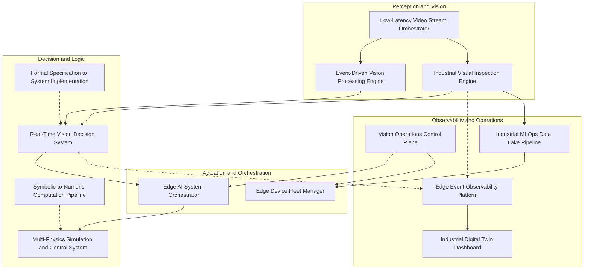

# Industrial Edge Labs Documentation

This repository is the canonical documentation hub for the Industrial Edge Labs ecosystem. It tracks architecture, compatibility contracts, and per-node design notes for the 13 functional repositories in the stack.

See also:

- [Master Architecture](./ARCHITECTURE.md)
- [Compatibility Matrix](./COMPATIBILITY_MATRIX.md)

## Topology Overview

## Repository Index

### Perception and Vision

- [Event-Driven Vision Processing Engine](https://github.com/Industrial-Edge-Labs/event-driven-vision-processing-engine)
- [Low-Latency Video Stream Orchestrator](https://github.com/Industrial-Edge-Labs/low-latency-video-stream-orchestrator)
- [Industrial Visual Inspection Engine](https://github.com/Industrial-Edge-Labs/industrial-visual-inspection-engine)

### Decision and Logic

- [Real-Time Vision Decision System](https://github.com/Industrial-Edge-Labs/real-time-vision-decision-system)
- [Symbolic-to-Numeric Computation Pipeline](https://github.com/Industrial-Edge-Labs/symbolic-to-numeric-computation-pipeline)
- [Formal Specification to System Implementation](https://github.com/Industrial-Edge-Labs/formal-specification-to-system-implementation)

### Actuation and Orchestration

- [Edge AI System Orchestrator](https://github.com/Industrial-Edge-Labs/edge-ai-system-orchestrator)
- [Edge Device Fleet Manager](https://github.com/Industrial-Edge-Labs/edge-device-fleet-manager)
- [Multi-Physics Simulation and Control System](https://github.com/Industrial-Edge-Labs/multi-physics-simulation-and-control-system)

### Observability and Operations

- [Vision Operations Control Plane](https://github.com/Industrial-Edge-Labs/vision-operations-control-plane)
- [Edge Event Observability Platform](https://github.com/Industrial-Edge-Labs/edge-event-observability-platform)
- [Industrial Digital Twin Dashboard](https://github.com/Industrial-Edge-Labs/industrial-digital-twin-dashboard)
- [Industrial MLOps Data Lake Pipeline](https://github.com/Industrial-Edge-Labs/industrial-mlops-data-lake-pipeline)
