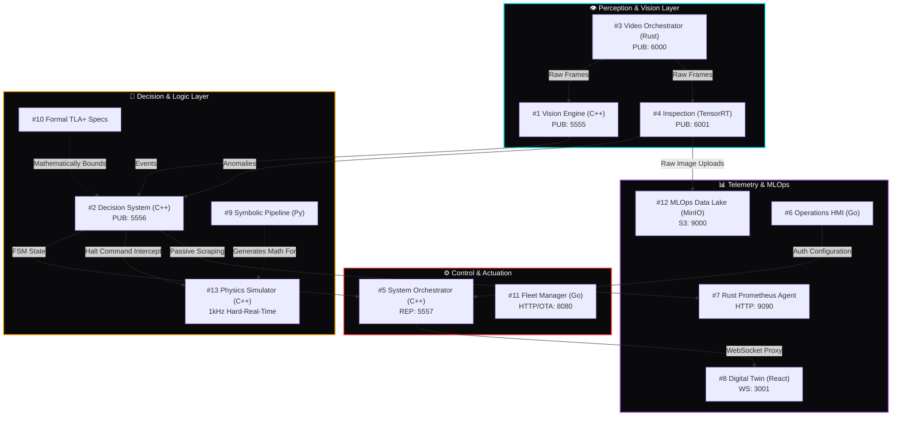

# Industrial Edge Labs: Master Architecture

Welcome to the centralized documentation cluster for the **Industrial Edge Labs** ecosystem. This nexus details the topological synchronization of 13 independent micro-repositories operating collectively to process multi-modal computational vision at the Edge, verify control constraints formally using Temporal Logic, and actuate hard real-time physical mechanisms.

See also: [Compatibility Matrix](./COMPATIBILITY_MATRIX.md)

## Ecosystem Network Topology (ZeroMQ DAG)

## The 13-Node Distributed Mapping

### 👁️ Perception & Vision
1. **[Event-Driven Vision Processing Engine](https://github.com/Industrial-Edge-Labs/event-driven-vision-processing-engine)** (`C++`/`CUDA`): Ingests fast-path zero-copy memory frames bypassing CPU overheads to evaluate bounds rapidly.
3. **[Low-Latency Video Stream Orchestrator](https://github.com/Industrial-Edge-Labs/low-latency-video-stream-orchestrator)** (`Rust`): Low-level binding pushing raw GigE network buffers down to ZeroMQ Publisher TCP pipelines.
4. **[Industrial Visual Inspection Engine](https://github.com/Industrial-Edge-Labs/industrial-visual-inspection-engine)** (`Python`/`TensorRT`): Quantized deep-learning inferences executing exclusively on GPU CUDA Cores to flag perimeter abnormalities.

### 🧠 Decision & Logic
2. **[Real-Time Vision Decision System](https://github.com/Industrial-Edge-Labs/real-time-vision-decision-system)** (`C++`): Multiplexes threaded streams originating from Vision engines and maps constraints to determine critical physical actions (E.g., `EMERGENCY_HALT`).
9. **[Symbolic-to-Numeric Computation Pipeline](https://github.com/Industrial-Edge-Labs/symbolic-to-numeric-computation-pipeline)** (`Python`): *Meta-Programming* SymPy abstract syntax trees to compile non-linear physical theorems directly into SIMD unrolled C++.
10. **[Formal Specification to System Implementation](https://github.com/Industrial-Edge-Labs/formal-specification-to-system-implementation)** (`TLA+`): A mathematical Model Checking bound preventing dynamic concurrency deadlocks from manifesting across C++ boundaries.

### ⚙️ Actuation & Orchestration
5. **[Edge AI System Orchestrator](https://github.com/Industrial-Edge-Labs/edge-ai-system-orchestrator)** (`C++20`): High-affinity threading core coordinating logical checkpoints and issuing hard stop commands.
11. **[Edge Device Fleet Manager](https://github.com/Industrial-Edge-Labs/edge-device-fleet-manager)** (`Go`): Massive Thread-Safe REST interface distributing OTA (Over-The-Air) firmware revisions and polling camera health.
13. **[Multi-Physics Simulation & Control System](https://github.com/Industrial-Edge-Labs/multi-physics-simulation-and-control-system)** (`C++20`): $1\text{kHz}$ simulator driving strictly controlled physical robotic actuators dynamically reacting to Vision Engine verdicts.

### 📊 Observability & Subsystems
6. **[Vision Operations Control Plane](https://github.com/Industrial-Edge-Labs/vision-operations-control-plane)** (`Go`): HTTP/REST administration gateways pushing locked config blocks (`ZMQ_REQ`) down into native processes.
7. **[Edge Event Observability Platform](https://github.com/Industrial-Edge-Labs/edge-event-observability-platform)** (`Rust`): Ultra-passive `Hyper/ZMQ` background exporter generating immediate visual dashboards via Prometheus mappings.
8. **[Industrial Digital Twin Dashboard](https://github.com/Industrial-Edge-Labs/industrial-digital-twin-dashboard)** (`React`/`WebGL`): Gorgeous WebGL node executing `ThreeJS` frames matching zero-latency physical hardware statuses through WebSockets.
12. **[Industrial MLOps Data Lake Pipeline](https://github.com/Industrial-Edge-Labs/industrial-mlops-data-lake-pipeline)** (`Python`/`MinIO`): Broad S3 Object Storage sink designed to funnel physical defection imagery back into the Training Clusters iteratively.

---
> ⚠️ Engineered precisely under **Hard Real-Time Bounds ($<1\text{ms}$)** to support Autonomous Manufacturing Frameworks.
