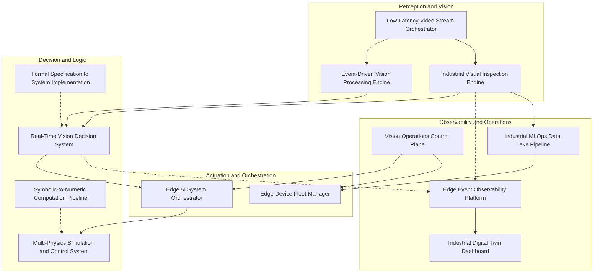

# Industrial Edge Labs Documentation

This MkDocs entry mirrors the canonical documentation overview in the repository root.

See also:

- [Master Architecture](../ARCHITECTURE.md)
- [Compatibility Matrix](../COMPATIBILITY_MATRIX.md)

