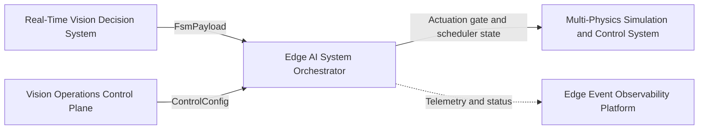
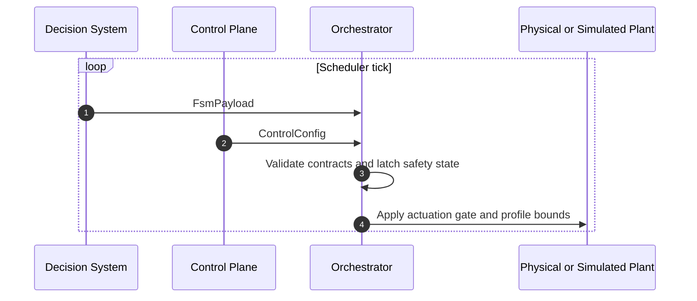
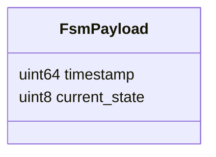
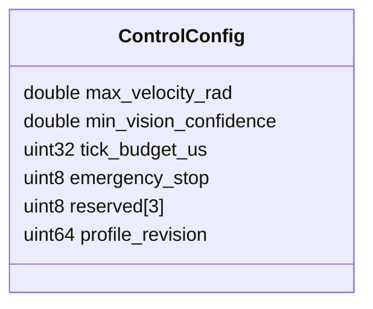
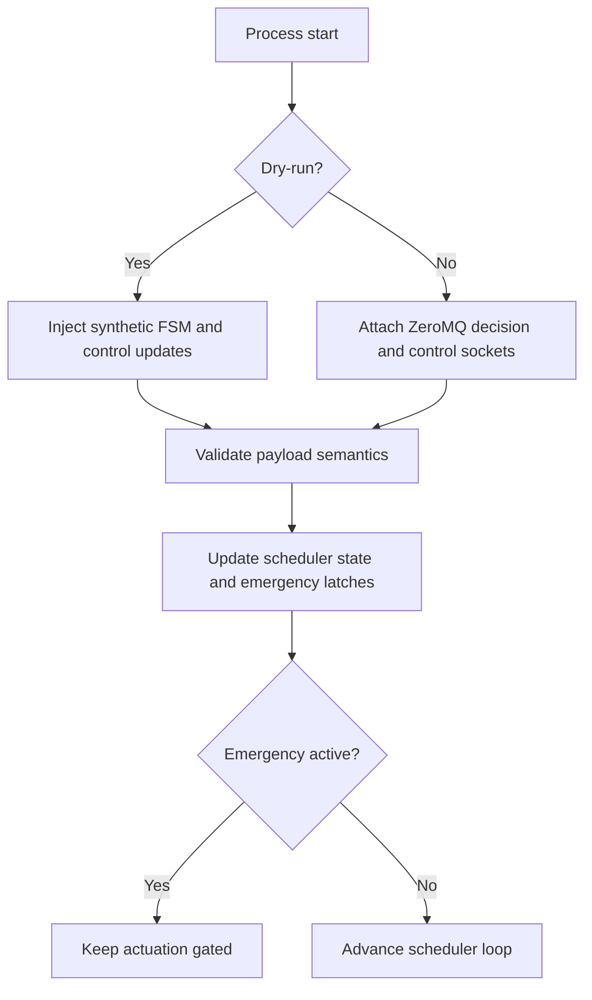

# Edge AI System Orchestrator

## Scope

This document describes the external architecture of the [edge-ai-system-orchestrator](https://github.com/Industrial-Edge-Labs/edge-ai-system-orchestrator) repository inside the [docs-Industrial-Edge-Labs](https://github.com/Industrial-Edge-Labs/docs-Industrial-Edge-Labs) repository.

The node is the deterministic coordinator between the decision layer and the actuation-facing runtime. It consumes `FsmPayload` from [real-time-vision-decision-system](https://github.com/Industrial-Edge-Labs/real-time-vision-decision-system), accepts `ControlConfig` messages from [vision-operations-control-plane](https://github.com/Industrial-Edge-Labs/vision-operations-control-plane), and maintains the emergency-stop and control-profile state required by the plant-facing loop.

The repository now supports both a ZeroMQ-enabled integration mode and a portable dry-run mode for scheduler validation on machines without the full runtime stack.

## Position In The Flow

## Execution Model

## Input Contracts

### FSM Input

### Control Input

## Runtime Modes

## Design Notes

- The default build is portable and does not require CUDA or ZeroMQ.
- `FsmPayload` and `ControlConfig` are validated semantically before they affect the scheduler.
- Decision-triggered emergency halt and control-plane emergency override are tracked independently, so a control-plane packet cannot clear a decision-latched stop by accident.
- The current repository exposes the deterministic actuation gate and profile state locally inside the orchestrator process; downstream plant and telemetry buses remain the next integration step.

## Recommended Next Steps

1. Export an explicit downstream actuation or telemetry payload for [multi-physics-simulation-and-control-system](https://github.com/Industrial-Edge-Labs/multi-physics-simulation-and-control-system) and [edge-event-observability-platform](https://github.com/Industrial-Edge-Labs/edge-event-observability-platform).
2. Extend the control contract if [vision-operations-control-plane](https://github.com/Industrial-Edge-Labs/vision-operations-control-plane) needs richer profile toggles or signed reset semantics.
3. Reconcile the plant-side subscriber topology so plant integration consistently flows through the orchestrator rather than subscribing directly to the decision bus.
