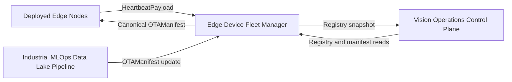
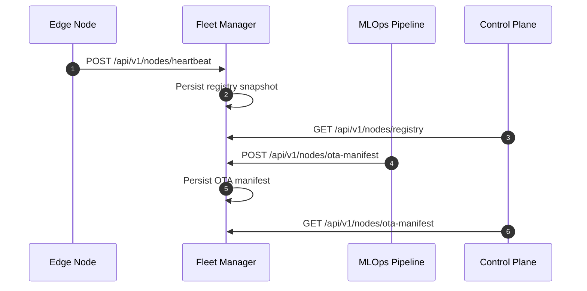
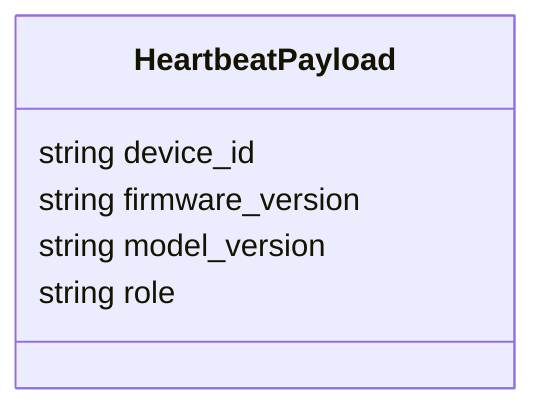
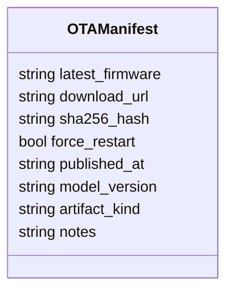

# Edge Device Fleet Manager

## Scope

This document describes the external architecture of the [edge-device-fleet-manager](https://github.com/Industrial-Edge-Labs/edge-device-fleet-manager) repository inside the [docs-Industrial-Edge-Labs](https://github.com/Industrial-Edge-Labs/docs-Industrial-Edge-Labs) repository.

The node is the deployment and inventory anchor for the Industrial Edge Labs runtime. It receives device heartbeats from deployed services, persists a registry snapshot, and exposes the canonical OTA manifest consumed by [vision-operations-control-plane](https://github.com/Industrial-Edge-Labs/vision-operations-control-plane) and [industrial-mlops-data-lake-pipeline](https://github.com/Industrial-Edge-Labs/industrial-mlops-data-lake-pipeline).

## Position In The Flow

## Execution Model

## Primary Contracts

### HeartbeatPayload

### OTAManifest

## Runtime Notes

- The repository persists state to JSON files so the service stays operational without Redis or SQL.
- Registry snapshots are sorted deterministically by device identifier before serialization.
- A watchdog marks nodes offline when heartbeat deadlines expire.
- The OTA manifest is updateable over HTTP instead of being compiled into the service binary.

## Recommended Next Steps

1. Add signed manifest verification if OTA publication needs a cryptographic trust boundary.
2. Extend the registry model if per-node capabilities or deployment groups become necessary.
3. Add end-to-end health probes from [vision-operations-control-plane](https://github.com/Industrial-Edge-Labs/vision-operations-control-plane) once the operational UI starts issuing deployment actions.
