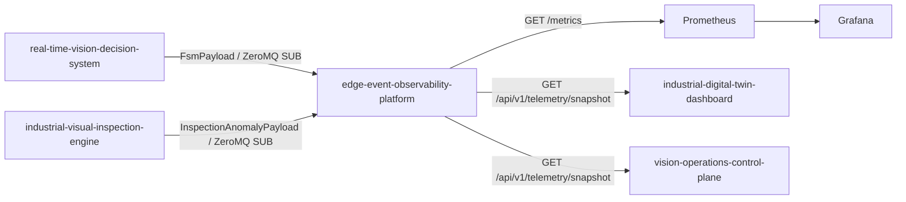

# Edge Event Observability Platform Architecture

## Purpose

[Edge Event Observability Platform](https://github.com/Industrial-Edge-Labs/edge-event-observability-platform) converts binary state streams into monitoring surfaces that are safe for dashboards and operators. It does not sit in the control hot path; it passively subscribes to canonical streams and derives metrics and snapshots from them.

## Runtime Topology

## Contract Details

### Decision Stream

The observability node subscribes to the 9-byte `FsmPayload` produced by [Real-Time Vision Decision System](https://github.com/Industrial-Edge-Labs/real-time-vision-decision-system).

- `timestamp` `u64`
- `current_state` `u8`

### Inspection Stream

The observability node subscribes to the 40-byte `InspectionAnomalyPayload` produced by [Industrial Visual Inspection Engine](https://github.com/Industrial-Edge-Labs/industrial-visual-inspection-engine).

- `timestamp_ns` `u64`
- `frame_id` `u64`
- `confidence` `f32`
- `x` `f32`
- `y` `f32`
- `width` `f32`
- `height` `f32`
- `class_id` `u32`

### Exported Surfaces

- `/metrics`: Prometheus exposition for state counts, anomaly counts, current state, and last anomaly data.
- `/api/v1/telemetry/snapshot`: current runtime snapshot serialized as JSON for non-hot-path consumers.
- `/healthz`: process liveness check.

## Operational Notes

- The default runtime is portable and can run in synthetic mode without ZeroMQ.
- ZeroMQ ingestion is enabled only when the binary is compiled with the `zeromq` feature.
- Prometheus is expected to scrape the exporter from `host.docker.internal:9090` when using the provided Compose stack.
