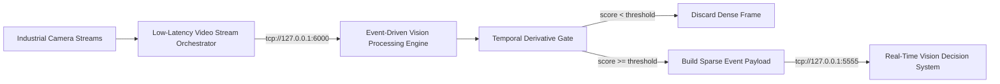
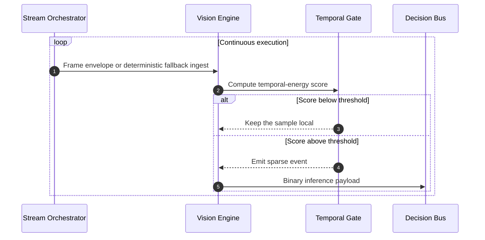
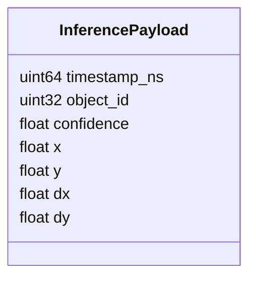
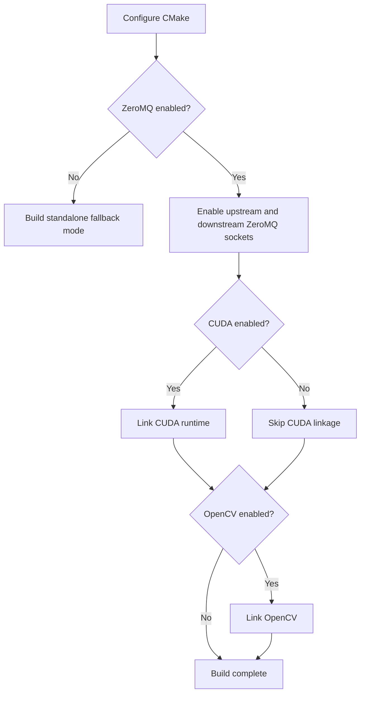

# Event-Driven Vision Processing Engine

## Scope

This document describes the external architecture of the [event-driven-vision-processing-engine](https://github.com/Industrial-Edge-Labs/event-driven-vision-processing-engine) repository inside the [docs-Industrial-Edge-Labs](https://github.com/Industrial-Edge-Labs/docs-Industrial-Edge-Labs) repository.

The node transforms dense video ingress into sparse motion events so that downstream deterministic systems can react without evaluating every full frame.

## Repository Interfaces

- Upstream producer: [low-latency-video-stream-orchestrator](https://github.com/Industrial-Edge-Labs/low-latency-video-stream-orchestrator)
- Downstream consumer: [real-time-vision-decision-system](https://github.com/Industrial-Edge-Labs/real-time-vision-decision-system)
- Local implementation: [event-driven-vision-processing-engine](https://github.com/Industrial-Edge-Labs/event-driven-vision-processing-engine)

## Operational Flow

## Execution Stages

## Current Runtime Model

The current implementation is intentionally split into two execution modes:

1. Integrated mode, where the node consumes upstream frame envelopes over ZeroMQ and publishes events to the decision layer.
2. Portable fallback mode, where the node keeps running deterministically even if the upstream video orchestrator is offline.

This keeps the node testable on a standalone workstation while preserving the same message contract used for integration.

## Binary Event Contract

### Field Semantics

- `timestamp_ns`: monotonic event timestamp.
- `object_id`: monotonically increasing identifier for the emitted sparse event.
- `confidence`: normalized event confidence in the `[0, 1)` range.
- `x`, `y`: compact spatial location of the event.
- `dx`, `dy`: compact motion trend of the event.

## Upstream Envelope Contract

The current runtime expects a compact upstream frame envelope with:

- `timestamp`
- `frame_id`
- `width`
- `height`
- `channels`

If the upstream producer sends a geometry that does not match the configured ingest shape, the envelope is dropped instead of being forwarded into the event path. This keeps the hot path deterministic and avoids accidental drift between [low-latency-video-stream-orchestrator](https://github.com/Industrial-Edge-Labs/low-latency-video-stream-orchestrator) and [event-driven-vision-processing-engine](https://github.com/Industrial-Edge-Labs/event-driven-vision-processing-engine).

## Build Strategy

The runtime is designed to compile out of the box in standalone fallback mode, without forcing ZeroMQ, CUDA, or OpenCV when those libraries are not yet needed by the active code path.

## Design Notes

- The node emits binary payloads instead of JSON in the hot path.
- The fallback ingest is deterministic so that dry-run behavior is reproducible.
- Geometry validation happens before a frame envelope is accepted into the event path.
- The current temporal-energy stage is a deterministic surrogate, not yet the final CUDA derivative kernel.

## Recommended Next Steps

1. Replace the deterministic surrogate with a true two-frame derivative kernel backed by pinned memory.
2. Version the upstream envelope contract explicitly so the interface with [low-latency-video-stream-orchestrator](https://github.com/Industrial-Edge-Labs/low-latency-video-stream-orchestrator) cannot drift silently.
3. Add a benchmark that reports discarded frames versus emitted events under fixed load.
4. Add a versioned event schema shared with [real-time-vision-decision-system](https://github.com/Industrial-Edge-Labs/real-time-vision-decision-system).
