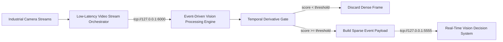
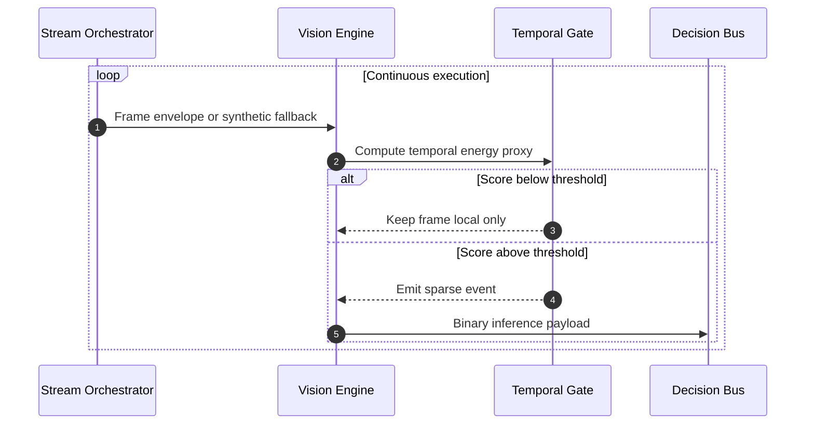
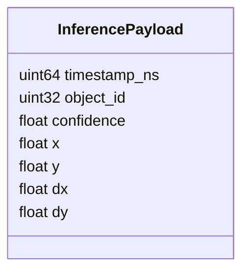
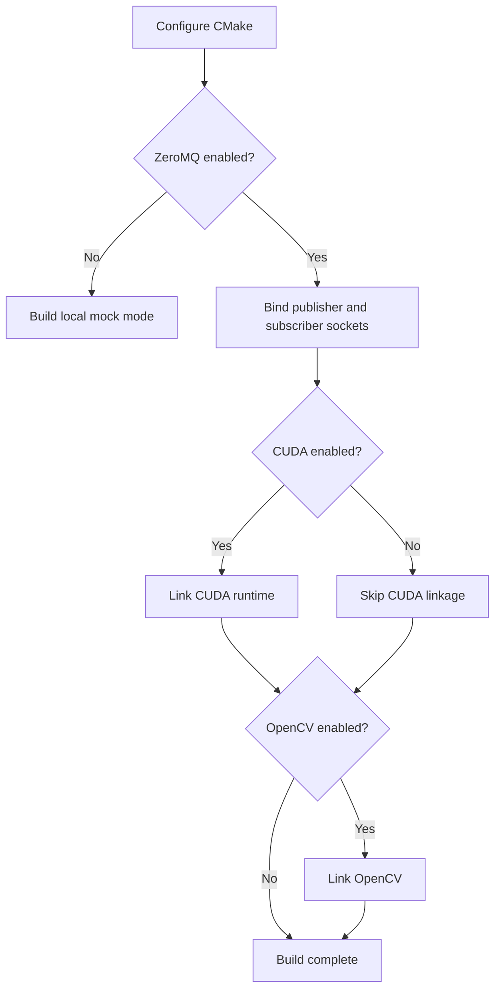

# Event-Driven Vision Processing Engine

## Purpose

Este nodo convierte una corriente de video densa en un flujo esparso de eventos geométricos. La meta no es inferir sobre cada frame completo, sino activar el pipeline de decisión solo cuando la energía temporal de la escena supera un umbral útil.

En otras palabras:

- Entrada: video continuo o envelopes de frames desde `low-latency-video-stream-orchestrator`.
- Transformación: estimación de actividad temporal similar a `|dI/dt|`.
- Salida: eventos binarios pequeños, listos para `real-time-vision-decision-system`.

## Operational Flow

## Internal Stages

## Current Runtime Model

La implementación actual no pretende ser todavía el kernel CUDA final. En esta etapa hace cuatro cosas importantes:

1. Permite ingestión real por ZeroMQ si el nodo `#3` está activo.
2. Mantiene un modo sintético para que el módulo pueda probarse solo.
3. Genera timestamps reales y `object_id` monotónicos, evitando payloads falsos constantes.
4. Conserva un contrato binario pequeño para no meter JSON en el hot path.

## Binary Message Contract

### Field Meaning

- `timestamp_ns`: marca temporal monotónica del evento emitido.
- `object_id`: identificador incremental del objeto/evento observado.
- `confidence`: puntuación normalizada del detector temporal.
- `x`, `y`: localización espacial resumida del evento.
- `dx`, `dy`: desplazamiento o tendencia de movimiento.

## Why Synthetic Fallback Exists

El proyecto completo tiene dependencias cruzadas. Si `low-latency-video-stream-orchestrator` aún no está levantado, este nodo no debería quedar inutilizable. Por eso conserva un modo sintético:

- ayuda a depurar el bus ZeroMQ hacia `#2`,
- permite probar latencia y contratos de mensajes,
- reduce el costo de validar el nodo por separado.

## Build Strategy

El `CMake` del módulo ahora separa dependencias opcionales de dependencias realmente usadas por el código actual.

## Recommended Near-Term Next Steps

1. Reemplazar el score sintético por un buffer real de dos frames y una magnitud temporal calculada sobre memoria fijada.
2. Definir el contrato upstream desde `#3` con un envelope estable y documentado.
3. Añadir un benchmark reproducible de tasa de eventos emitidos vs. frames descartados.
4. Versionar explícitamente el contrato binario para evitar drift con `#2`.
