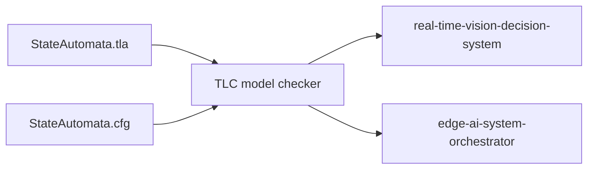

# Formal Specification To System Implementation Architecture

## Purpose

[Formal Specification To System Implementation](https://github.com/Industrial-Edge-Labs/formal-specification-to-system-implementation) provides the formal safety boundary of the runtime. It models the canonical state machine and the orchestrator emergency-latch semantics so the implementation can be checked against explicit invariants instead of relying only on runtime testing.

## Runtime Topology

## Verified Properties

- `TypeInvariant`
- `Safety_NoSilentBypass`
- `Safety_LatchMatchesEmergency`
- `Liveness_BreachProgress`
- `Property_LatchIsSticky`

## Operational Notes

- The spec explicitly models `AUTHORIZATION_PENDING` as an intermediate state.
- The control-plane emergency signal and the decision emergency latch are modeled separately.
- The verification scripts download `tla2tools.jar` on demand so the repo stays lightweight until TLC is needed.
