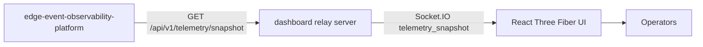

# Industrial Digital Twin Dashboard Architecture

## Purpose

[Industrial Digital Twin Dashboard](https://github.com/Industrial-Edge-Labs/industrial-digital-twin-dashboard) is the human-facing visualization node of the system. Its relay process polls [Edge Event Observability Platform](https://github.com/Industrial-Edge-Labs/edge-event-observability-platform), normalizes the snapshot, and re-broadcasts it to the browser over Socket.IO.

## Runtime Topology

## Contract Details

### Upstream Snapshot

The relay consumes the JSON snapshot exposed by [Edge Event Observability Platform](https://github.com/Industrial-Edge-Labs/edge-event-observability-platform).

- `mode`
- `last_fsm`
- `last_anomaly`
- `fsm_messages_total`
- `inspection_messages_total`
- 64-bit counters and timestamps encoded as strings

### Relay Snapshot

The relay republishes a browser-safe normalized payload over Socket.IO and `GET /api/v1/telemetry/snapshot`.

- `relayStatus`
- `fsmState`
- `fsmStateName`
- `lastUpdateNs`
- `fsmMessagesTotal`
- `inspectionMessagesTotal`
- `anomaly`
- `sourceSnapshotUrl`
- `relayPolledAt`

## Operational Notes

- The dashboard is intentionally decoupled from ZeroMQ and hot-path binary buses.
- If the upstream snapshot degrades, the relay keeps serving the last known normalized state with `relayStatus = degraded`.
- The browser UI can be developed independently from the upstream control processes by pointing the relay at a mock snapshot source.
