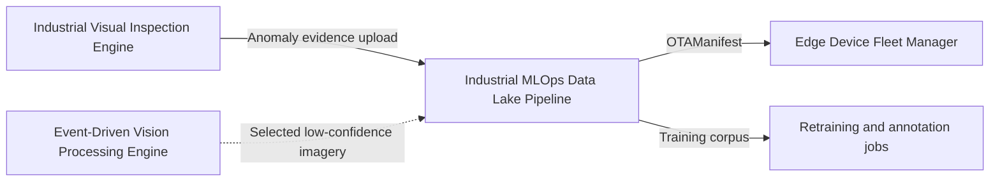
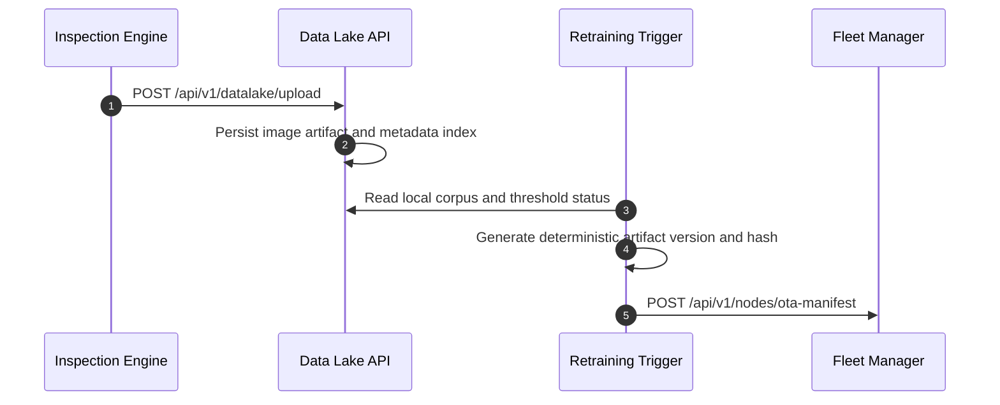
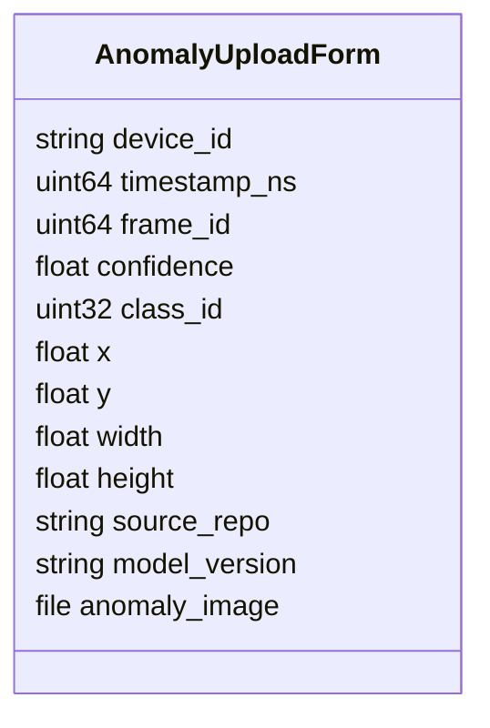
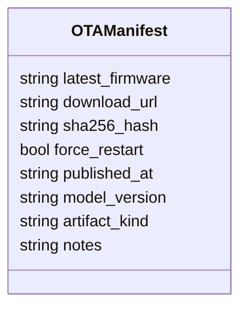

# Industrial MLOps Data Lake Pipeline

## Scope

This document describes the external architecture of the [industrial-mlops-data-lake-pipeline](https://github.com/Industrial-Edge-Labs/industrial-mlops-data-lake-pipeline) repository inside the [docs-Industrial-Edge-Labs](https://github.com/Industrial-Edge-Labs/docs-Industrial-Edge-Labs) repository.

The node ingests inspection-side anomaly evidence, persists a structured corpus, and generates OTA manifests once the retraining threshold has been satisfied. The default runtime is portable and stores data locally, while an optional MinIO mode preserves S3-compatible behavior.

## Position In The Flow

## Execution Model

## Primary Contracts

### Upload Form Fields

### OTA Manifest

## Runtime Notes

- Local filesystem mode persists both binary artifacts and a deterministic `index.json` metadata ledger.
- MinIO mode keeps the same metadata ledger while uploading the binary artifact to an S3-compatible bucket.
- Retraining manifest generation is deterministic from the currently stored corpus.

## Recommended Next Steps

1. Add signed model artifact verification before production OTA publication.
2. Add an annotation status field if human review enters the active learning loop.
3. Wire the upload client directly into [industrial-visual-inspection-engine](https://github.com/Industrial-Edge-Labs/industrial-visual-inspection-engine) once the GPU inference runtime is ready to export crops asynchronously.
