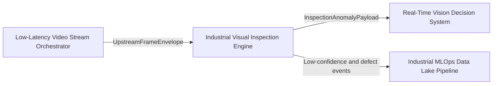
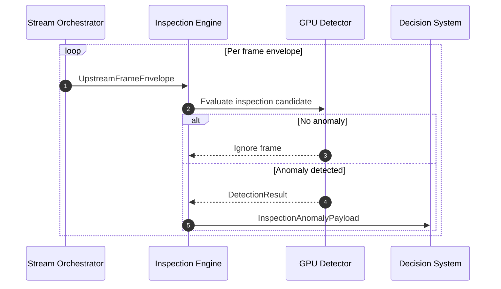
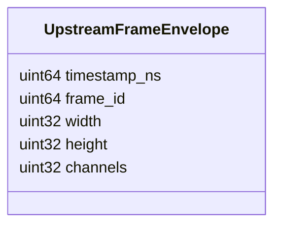
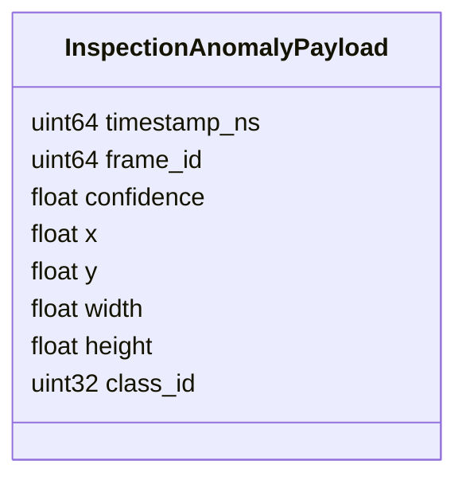

# Industrial Visual Inspection Engine

## Scope

This document describes the external architecture of the [industrial-visual-inspection-engine](https://github.com/Industrial-Edge-Labs/industrial-visual-inspection-engine) repository inside the [docs-Industrial-Edge-Labs](https://github.com/Industrial-Edge-Labs/docs-Industrial-Edge-Labs) repository.

The node is the inspection-side GPU inference branch of the vision path. It consumes the canonical upstream frame envelope published by [low-latency-video-stream-orchestrator](https://github.com/Industrial-Edge-Labs/low-latency-video-stream-orchestrator) and emits a compact anomaly payload for [real-time-vision-decision-system](https://github.com/Industrial-Edge-Labs/real-time-vision-decision-system).

## Position In The Flow

## Execution Model

## Canonical Upstream Contract

The upstream envelope must remain identical to the one consumed by [event-driven-vision-processing-engine](https://github.com/Industrial-Edge-Labs/event-driven-vision-processing-engine).

## Inspection Anomaly Contract

### Field Semantics

- `timestamp_ns`: anomaly emission timestamp.
- `frame_id`: originating frame identifier.
- `confidence`: anomaly confidence score.
- `x`, `y`: anomaly center or reference position.
- `width`, `height`: compact defect bounds.
- `class_id`: coarse defect class identifier.

## Design Notes

- The current detector is still a deterministic surrogate around the payload contract.
- The runtime validates payload size before decoding upstream messages.
- The runtime publishes a dedicated anomaly payload instead of replaying the upstream frame header.
- The downstream decision node can therefore distinguish inspection anomalies from standard motion events.

## Recommended Next Steps

1. Replace the deterministic detector surrogate with the actual TensorRT or PyTorch-backed inference graph.
2. Extend the anomaly contract with class taxonomy if the downstream decision logic needs more than a coarse defect identifier.
3. Add explicit low-confidence export for [industrial-mlops-data-lake-pipeline](https://github.com/Industrial-Edge-Labs/industrial-mlops-data-lake-pipeline).
