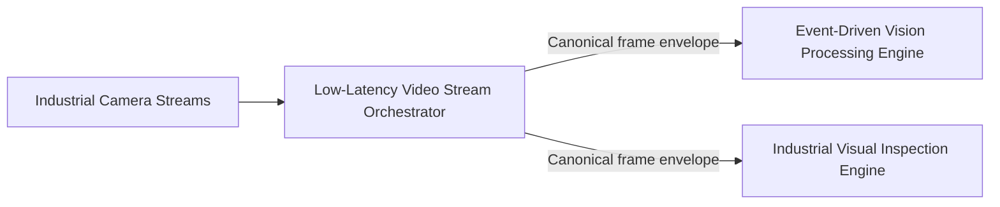
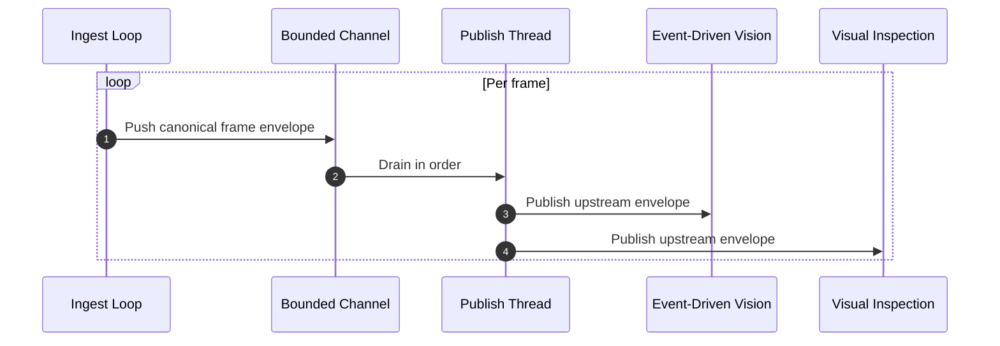
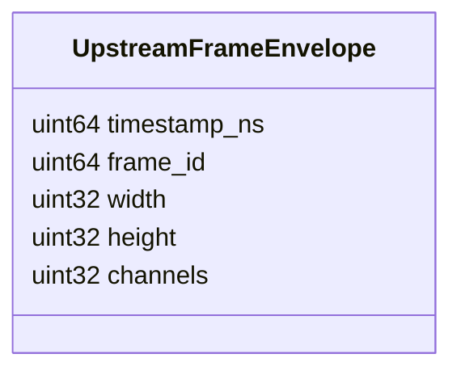
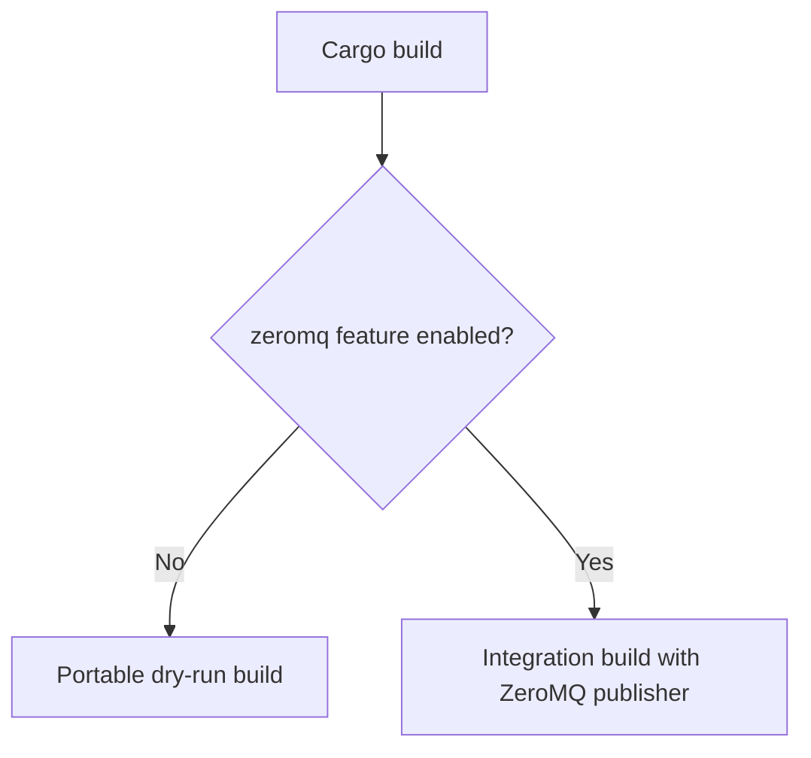

# Low-Latency Video Stream Orchestrator

## Scope

This document describes the external architecture of the [low-latency-video-stream-orchestrator](https://github.com/Industrial-Edge-Labs/low-latency-video-stream-orchestrator) repository inside the [docs-Industrial-Edge-Labs](https://github.com/Industrial-Edge-Labs/docs-Industrial-Edge-Labs) repository.

The node is the media ingress publisher for the fast vision path. Its primary job is to emit a canonical upstream frame envelope that can be consumed consistently by both [Event-Driven Vision Processing Engine](https://github.com/Industrial-Edge-Labs/event-driven-vision-processing-engine) and [Industrial Visual Inspection Engine](https://github.com/Industrial-Edge-Labs/industrial-visual-inspection-engine).

## Position In The Flow

## Execution Model

## Canonical Upstream Envelope

### Field Semantics

- `timestamp_ns`: monotonic capture timestamp.
- `frame_id`: monotonically increasing frame identifier.
- `width`: frame width.
- `height`: frame height.
- `channels`: frame channel count.

## Compatibility Contract

This node is the source of truth for the upstream frame envelope used by the early perception branch.

- [Event-Driven Vision Processing Engine](https://github.com/Industrial-Edge-Labs/event-driven-vision-processing-engine) must consume this exact envelope.
- [Industrial Visual Inspection Engine](https://github.com/Industrial-Edge-Labs/industrial-visual-inspection-engine) must consume this exact envelope.
- No legacy upstream shape should be kept once the system is aligned.

## Build Strategy

The repository supports two build modes:

The dry-run mode keeps the repository buildable on a workstation without ZeroMQ installed, while the integration build enables the actual publisher used by the system.

## Design Notes

- The runtime uses a bounded channel to decouple frame creation from publishing.
- The contract is binary and fixed-width to avoid text parsing in the hot path.
- The publish thread drains the queue with bounded waiting instead of indefinite hot spinning.
- Dropped frames are counted explicitly when the queue is full.
- The binary entrypoint is intentionally thin so the ingest pipeline can be tested without booting the full process.
- Configuration parsing is isolated from the runtime loop so CLI and environment defaults remain stable.

## Recommended Next Steps

1. Replace the mock frame generator with actual camera or NIC ingestion while preserving the exact envelope shape.
2. Add a shared contract reference in [event-driven-vision-processing-engine](https://github.com/Industrial-Edge-Labs/event-driven-vision-processing-engine) and [industrial-visual-inspection-engine](https://github.com/Industrial-Edge-Labs/industrial-visual-inspection-engine).
3. Add throughput and drop-rate reporting so downstream observability can correlate ingest pressure with system behavior.
