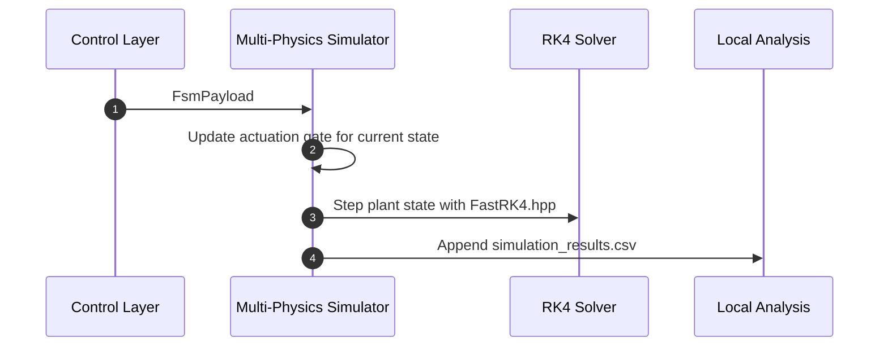
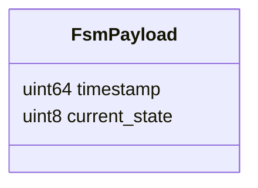
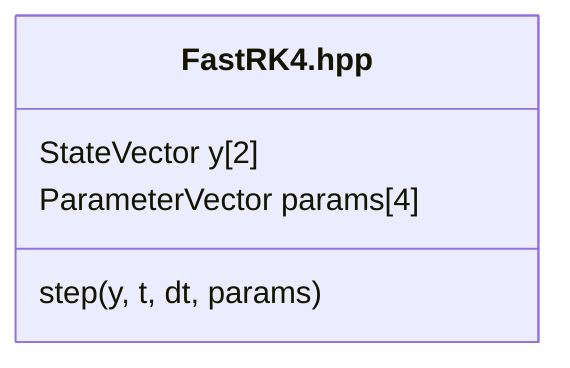

# Multi-Physics Simulation and Control System

## Scope

This document describes the external architecture of the [multi-physics-simulation-and-control-system](https://github.com/Industrial-Edge-Labs/multi-physics-simulation-and-control-system) repository inside the [docs-Industrial-Edge-Labs](https://github.com/Industrial-Edge-Labs/docs-Industrial-Edge-Labs) repository.

The node is the plant-facing simulation runtime for the Industrial Edge Labs stack. It consumes the canonical `FsmPayload` used by the control layer, applies deterministic actuation gating, and advances a mass-spring-damper model through the same RK4 solver shape generated by [symbolic-to-numeric-computation-pipeline](https://github.com/Industrial-Edge-Labs/symbolic-to-numeric-computation-pipeline).

## Position In The Flow

```mermaid
flowchart LR
    RTD[Real-Time Vision Decision System] -->|FsmPayload| ORCH[Edge AI System Orchestrator]
    ORCH -. compatible FSM gate .-> MPCS[Multi-Physics Simulation and Control System]
    SYM[Symbolic-to-Numeric Computation Pipeline] -. FastRK4.hpp .-> MPCS
    MPCS -->|simulation_results.csv| LocalTools[Plots and local dashboards]
```

## Execution Model



## Primary Contracts

### FSM Input



### Symbolic Numeric Artifact



## Runtime Notes

- The default build is portable and does not require ZeroMQ.
- The live integration path still uses the canonical FSM contract while the orchestrator-to-plant bus remains under active evolution.
- CSV telemetry is deterministic and includes time, state, position, velocity, force, damping, and brake status.

## Recommended Next Steps

1. Export an explicit downstream plant contract from [edge-ai-system-orchestrator](https://github.com/Industrial-Edge-Labs/edge-ai-system-orchestrator) once the actuation bus is finalized.
2. Mirror selected plant telemetry into [edge-event-observability-platform](https://github.com/Industrial-Edge-Labs/edge-event-observability-platform) if plant-side observability becomes part of the default runtime.
3. Promote the browser sandbox patterns into [industrial-digital-twin-dashboard](https://github.com/Industrial-Edge-Labs/industrial-digital-twin-dashboard) when the UI contract stabilizes.
