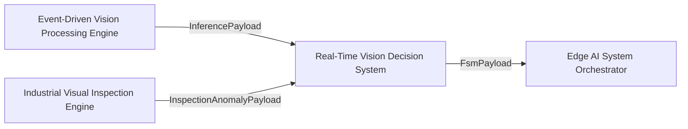
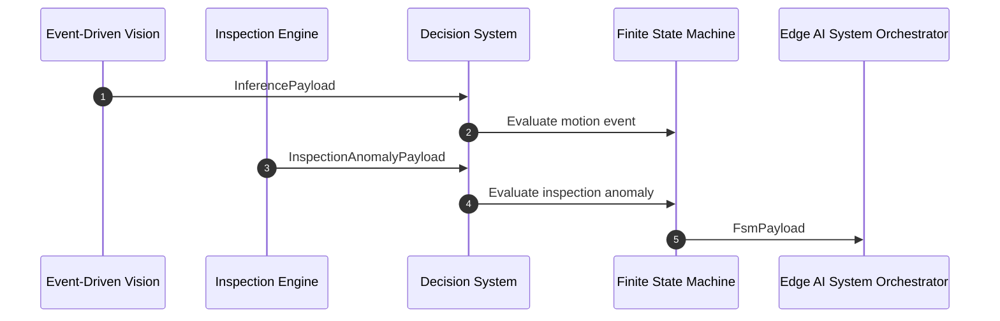
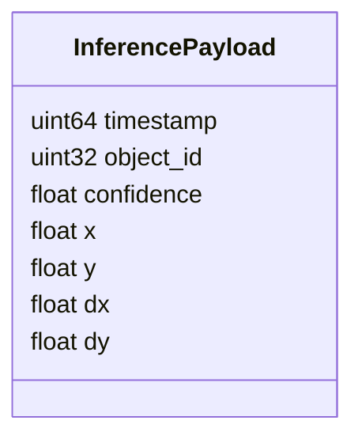
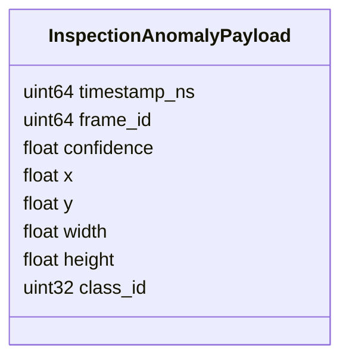
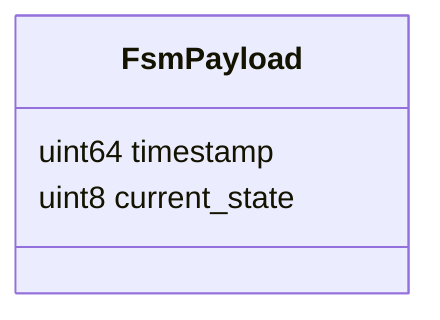
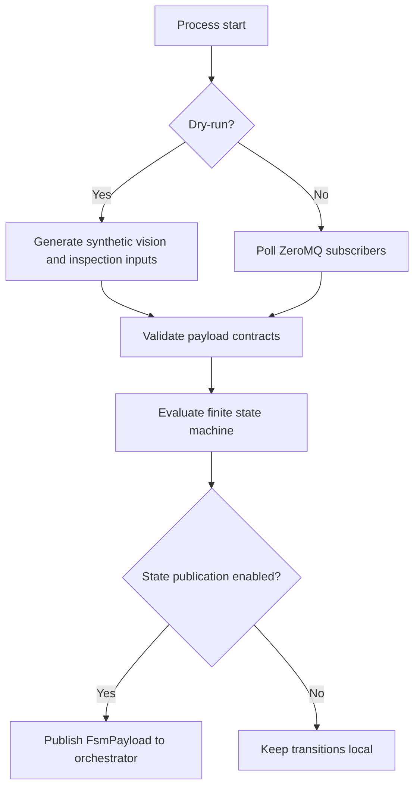
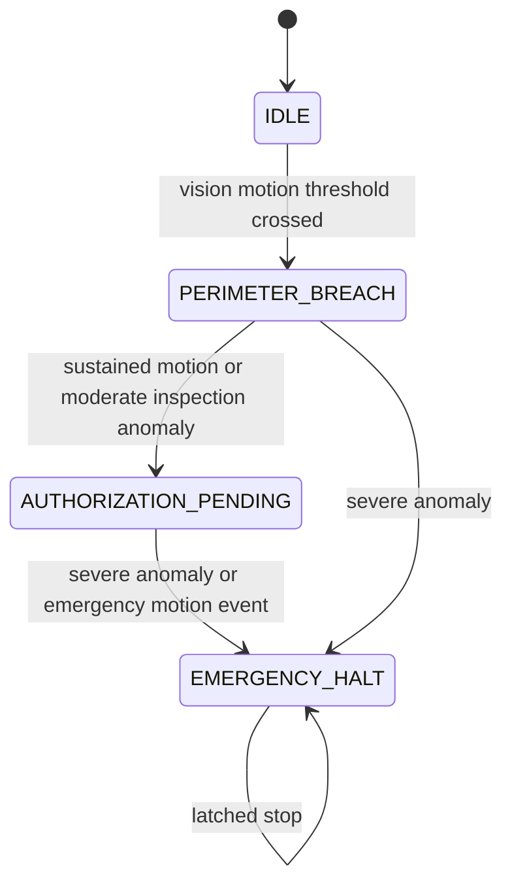

# Real-Time Vision Decision System

## Scope

This document describes the external architecture of the [real-time-vision-decision-system](https://github.com/Industrial-Edge-Labs/real-time-vision-decision-system) repository inside the [docs-Industrial-Edge-Labs](https://github.com/Industrial-Edge-Labs/docs-Industrial-Edge-Labs) repository.

The node is the deterministic convergence point for the early perception branch. It ingests motion events from [event-driven-vision-processing-engine](https://github.com/Industrial-Edge-Labs/event-driven-vision-processing-engine) and inspection anomalies from [industrial-visual-inspection-engine](https://github.com/Industrial-Edge-Labs/industrial-visual-inspection-engine), then emits FSM state transitions to [edge-ai-system-orchestrator](https://github.com/Industrial-Edge-Labs/edge-ai-system-orchestrator).

The repository supports both a ZeroMQ-enabled live topology and a portable dry-run mode that exercises both input branches without external dependencies.

## Position In The Flow

## Execution Model

## Input Contracts

### Vision Input

### Inspection Input

## Output Contract

By default the output is published on `tcp://127.0.0.1:5556`, which matches [edge-ai-system-orchestrator](https://github.com/Industrial-Edge-Labs/edge-ai-system-orchestrator).

## Runtime Modes

## State Progression

## Design Notes

- The runtime treats the inspection branch as an explicit contract, not as a generic byte trigger.
- The runtime validates payload semantics, not only payload size, before evaluating transitions.
- FSM state publication now follows the same state transitions stored internally.
- The default build remains portable without requiring ZeroMQ on the local machine.
- The ZeroMQ-enabled build preserves the live integration topology used by the rest of the system.

## Recommended Next Steps

1. Integrate formal constraints from [formal-specification-to-system-implementation](https://github.com/Industrial-Edge-Labs/formal-specification-to-system-implementation) directly into state transition guards.
2. Define a richer state taxonomy if [edge-ai-system-orchestrator](https://github.com/Industrial-Edge-Labs/edge-ai-system-orchestrator) needs more than perimeter breach and emergency halt.
3. Add a replayable test harness that feeds recorded `InferencePayload` and `InspectionAnomalyPayload` samples into the FSM.
