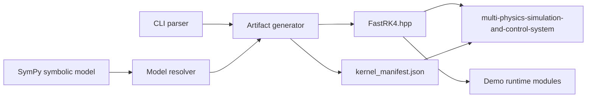

# Symbolic To Numeric Computation Pipeline Architecture

## Purpose

[Symbolic To Numeric Computation Pipeline](https://github.com/Industrial-Edge-Labs/symbolic-to-numeric-computation-pipeline) bridges symbolic derivation and compiled numerical execution. It uses SymPy to derive a canonical physics model, renders a stable C++ RK4 solver header, and emits a manifest so downstream systems can validate the generated artifact contract.

## Runtime Topology

## Contract Details

### Generated Header

- File name: `FastRK4.hpp`
- Class name: `physics::FastRK4Solver`
- State vector shape: `std::array<double, 2>`
- Parameter vector shape: `std::array<double, 4>`

### Manifest

- `generated_by`
- `header`
- `class_name`
- `model`
- `state_size`
- `parameter_count`
- `parameter_order`

## Operational Notes

- The current canonical model is a non-linear mass-spring-damper system with drag.
- The CMake graph regenerates the artifacts before compiling the demo consumer.
- The repository includes Python unit tests for artifact generation and C++ tests for the generated demo path.
- Downstream systems should treat the generated header and manifest as the stable boundary of this repository.
