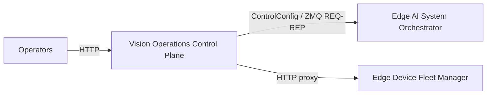
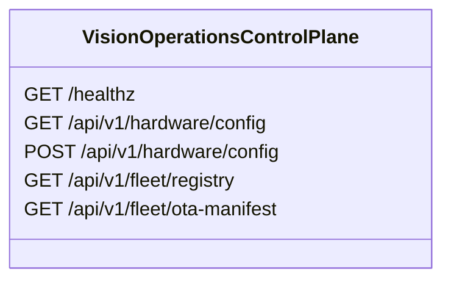
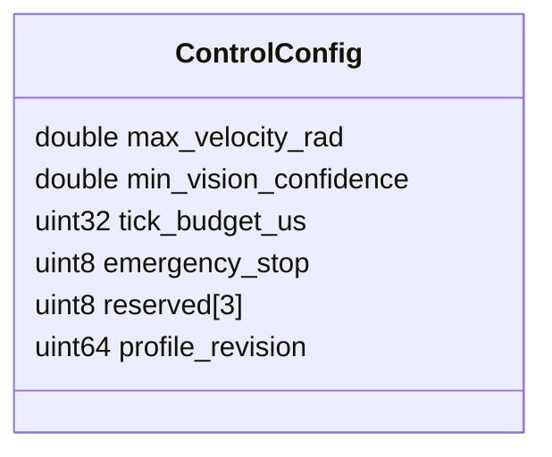

# Vision Operations Control Plane

## Scope

This document describes the external architecture of the [vision-operations-control-plane](https://github.com/Industrial-Edge-Labs/vision-operations-control-plane) repository inside the [docs-Industrial-Edge-Labs](https://github.com/Industrial-Edge-Labs/docs-Industrial-Edge-Labs) repository.

The node is the operator-facing HTTP gateway for runtime control changes. It accepts signed operator requests, encodes `ControlConfig` for [edge-ai-system-orchestrator](https://github.com/Industrial-Edge-Labs/edge-ai-system-orchestrator), and proxies fleet-facing read operations to [edge-device-fleet-manager](https://github.com/Industrial-Edge-Labs/edge-device-fleet-manager).

## Position In The Flow

## HTTP Surface

## Binary Contract

## Design Notes

- The HTTP bind defaults to `127.0.0.1:8081` so it does not conflict with [edge-device-fleet-manager](https://github.com/Industrial-Edge-Labs/edge-device-fleet-manager) on `:8080`.
- The `ControlConfig` wire block remains fixed at 32 bytes and matches [edge-ai-system-orchestrator](https://github.com/Industrial-Edge-Labs/edge-ai-system-orchestrator).
- Fleet proxy routes are read-only in the current version, which keeps the boundary between runtime control and fleet rollout explicit.
- Applied configurations are persisted locally for restart continuity.

## Recommended Next Steps

1. Add authenticated rollout or drain operations once [edge-device-fleet-manager](https://github.com/Industrial-Edge-Labs/edge-device-fleet-manager) exposes stable write-side APIs.
2. Add request authentication middleware if the HTTP control plane will be exposed beyond localhost or an internal service mesh.
3. Export control-plane audit events to [edge-event-observability-platform](https://github.com/Industrial-Edge-Labs/edge-event-observability-platform).
